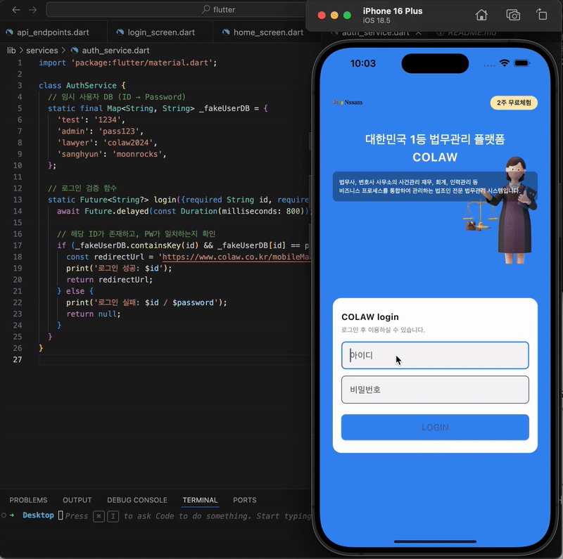

# COLAW Flutter iOS 로그인 앱

- Flutter 기반으로 iOS 느낌의 로그인 UI
- WebView 기반 홈화면(세션 없이 구현)
- 테스트용 백엔드 예시를 포함한 프로젝트



## 🚀 기능
- Flutter Frontend (iOS 스타일 로그인 화면 구성)
- WebView 활용한 `https://www.colaw.co.kr` 홈 화면 이동 (세션 문제로 다시 돌아옴)
- Node.js 기반 테스트용 로그인 서버 포함 (`backend-test/server.js`)
- 임시 사용자 DB 기반 로그인 API

## ⚠️ 구현 & 동작 방식 요약

- 🛠 **임시 로그인 DB (test용)**  
  실제 사용자 계정은 사용하지 않고, `auth_service.dart`에 미리 등록된 계정(`test`, `admin`, `lawyer`, `sanghyun` 등)만 로그인 가능
```bash
    static final Map<String, String> _fakeUserDB = {
    'test': '1234',
    'admin': 'pass123',
    'lawyer': 'colaw2024',
    'sanghyun': 'moonrocks',
  };
```
- 🔄 **테스트용 action URL 사용**  
  로그인 성공 시 실제 `https://www.colaw.co.kr` 웹사이트의 action URL로 이동하지만, 세션은 유지되지 않습니다.

- 🔙 **세션 미유지로 인한 리디렉션**  
  따라서 홈 화면으로 이동한 뒤 다시 colaw 웹 로그인 UI로 리디렉션됩니다. 이는 현재 세션 관리가 구현되지 않아 발생하는 정상적인 동작입니다.

## 🛠️ 실행 방법
```bash
cd project-root
flutter pub get
flutter run

1. XCode 설치 확인 : `xcode-select -p`
2. iOS 시뮬레이터 실행 : `open -a Simulator`
3. Flutter가 인식하는지 확인 : `flutter devices`
4. 앱 실행 : `flutter run -d "iPhone 16 Plus"`
```

## 📁 구조
- `lib/` : 앱 실행 코드  
- `assets/` : 이미지, 폰트 등  
- `backend-test/` : 로그인 API 테스트 서버  
- `android/, ios/, web/` : 플랫폼별 설정  

## 🌲 Tree
```bash
lib/
├── main.dart                    # 앱 진입점
├── app.dart                     # MaterialApp 및 라우트 설정
├── screens/                     # 화면 UI 모듈
│   ├── login_screen.dart        # 로그인 화면
│   └── home_screen.dart         # WebView 기반 홈 화면
├── widgets/                     # 재사용 가능한 위젯
│   └── custom_textfield.dart
├── services/                    # API 통신 로직
│   └── auth_service.dart
├── models/                      # 데이터 모델
│   └── user.dart
├── constants/                   # 상수 정의
│   ├── colors.dart
│   └── api_endpoints.dart
└── utils/                       # 유틸 함수 모음
    └── validator.dart

assets/                          # 정적 리소스
├── images/
└── fonts/

backend-test/                    # 테스트용 백엔드 (Node.js)
├── server.js
├── package.json
└── node_modules/

pubspec.yaml                     # 의존성 및 자원 선언

android/                         # Android 설정
ios/                             # iOS 설정
web/                             # Web 설정 (옵션)

.gitignore                       # Git 무시 목록
README.md                        # 프로젝트 설명
